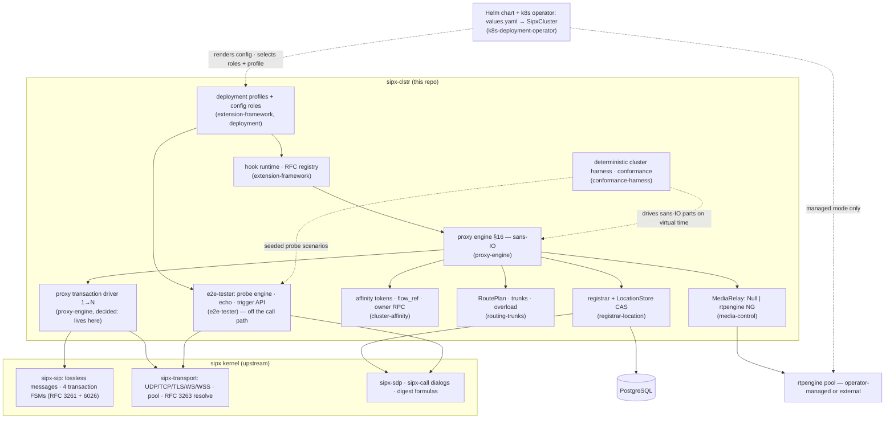
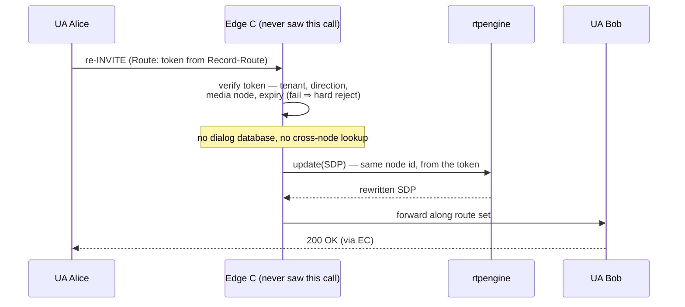
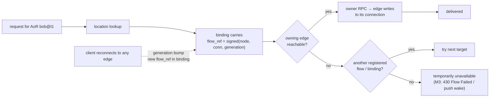
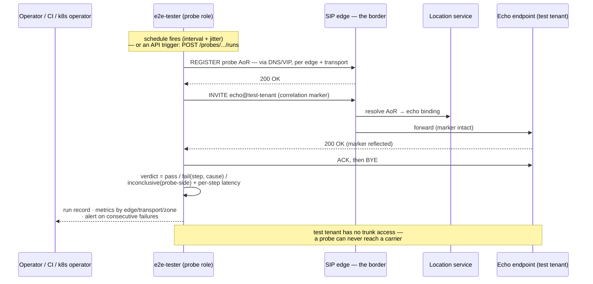
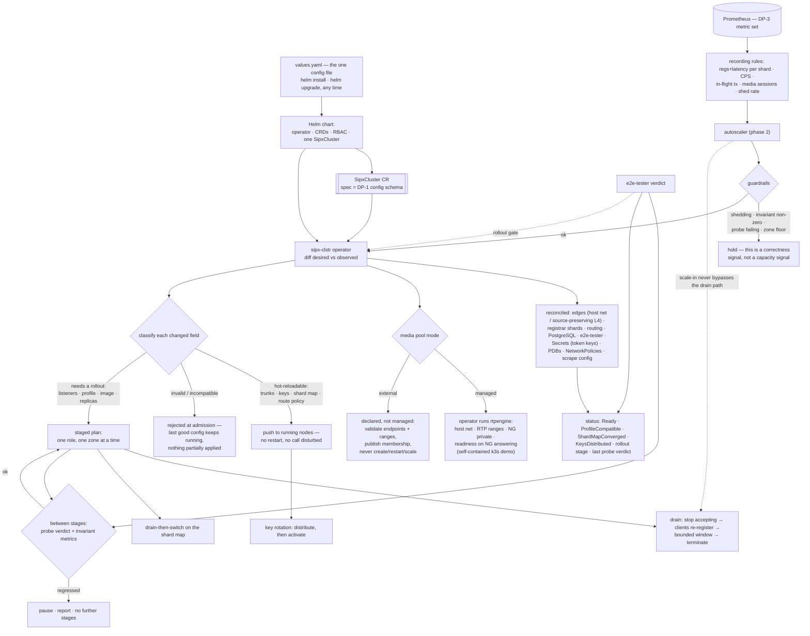

# sipx-clstr — architecture charts

Companion charts to the [vision](vision.md) and the epic [designs](designs/). Each chart names
the design doc that owns its decisions; when a chart and a design disagree, the design wins.

## 1. Cluster topology

The reference deployment ([deployment](designs/deployment.md)): one region, three zones, every
signalling node the same binary with roles from config. Media is its own pool, controlled — never
linked ([media-control](designs/media-control.md)) — whether the Kubernetes operator manages that
pool or it is external ([k8s-deployment-operator](designs/k8s-deployment-operator.md)). The
`e2e-tester` role is drawn outside the border on purpose: it enters through the public path like
any customer, because a probe that skips the front door cannot detect a broken front door
([e2e-tester](designs/e2e-tester.md)).

```text
  Public SIP — carriers / trunks / UAs     e2e-tester (probe role)
                    |                  dials the border on a schedule
                    |                   or when its API is triggered
                    |                                 |
                    +----------------+----------------+
                                     |
                     DNS NAPTR/SRV  +  L4 VIP (source-preserving)
                                     |
          +--------------------------+--------------------------+
          |                          |                          |
     SIP edge A                 SIP edge B                 SIP edge C
   UDP/TCP/TLS/WS/WSS         UDP/TCP/TLS/WS/WSS         UDP/TCP/TLS/WS/WSS
   owns its client conns      owns its client conns      owns its client conns
          |                          |                          |
          +----------- internal RPC (connection-owner) ---------+
          |                          |                          |
   +------+--------------------------+--------------------------+------+
   |                                 |                                 |
Registrar shards               Routing / policy                echo service
rendezvous(tenant‖AoR)         trunks · breakers               (test tenant AoR;
   |                           RoutePlan · overload            answers probes)
PostgreSQL (HA)                                                (later: B2BUA
serializable per-AoR txns                                      session services)
   |
   +---------------------- media allocator / MediaRelay ---------------+
                                     |
                    rendezvous(tenant ‖ Call-ID ‖ from-tag)
                                     |
              +----------------------+----------------------+
              |                      |                      |
        rtpengine A            rtpengine B            rtpengine C
        NG control (private)   RTP/SRTP (public)      dedicated hosts
```

Signalling scales by adding edges; media scales by adding relay nodes; neither waits on the
other. Management interfaces are private-network only.

## 2. Layering: what sipx provides, what sipx-clstr adds

The kernel boundary follows *upstream first* ([AGENTS.md](../AGENTS.md),
[upstream.md](upstream.md)): protocol logic below the line, orchestration above it.



## 3. Dialog-forming call: token minted, media anchored

An INVITE through the cluster ([proxy-engine](designs/proxy-engine.md),
[cluster-affinity](designs/cluster-affinity.md)). The proxy stays out of the dialog; the token it
plants in Record-Route is the only cluster state the call needs.

```mermaid
sequenceDiagram
    participant A as UA Alice
    participant E1 as Edge A
    participant L as Location service
    participant M as rtpengine (via MediaRelay)
    participant E2 as Edge B (owns Bob's conn)
    participant B as UA Bob
    A->>E1: INVITE (offer)
    E1->>E1: validate §16.3 · authenticate
    E1->>L: resolve AoR → bindings (Path, flow_ref)
    E1->>M: offer(SDP) — node chosen by rendezvous hash
    M-->>E1: rewritten SDP
    E1->>E1: mint affinity token → Record-Route<br/>(tenant · shard · media node · expiry · tag)
    E1->>E2: connection-owner RPC (Bob's flow_ref → Edge B)
    E2->>B: INVITE over Bob's owned connection
    B-->>E1: 200 OK (answer)
    E1->>M: answer(SDP)
    E1-->>A: 200 OK (Record-Route with token)
    A->>B: ACK — dialog is end-to-end; route set carries the token
```

## 4. Mid-dialog request: any edge, zero lookups

The defining property (*state rides the message*): the M2 exit criterion asserts the cross-node
dialog-lookup counter reads zero.



## 5. Connection ownership and node loss

Connections cannot move; ownership makes that explicit
([cluster-affinity](designs/cluster-affinity.md)). Service HA is the guarantee; call-survival HA
is deliberately not promised in v1 ([deployment](designs/deployment.md)).



## 6. The request pipeline is the hook surface

Extensions attach to typed phases; they never edit the core
([extension-framework](designs/extension-framework.md)). Media anchoring itself is just a module
on the offer/answer-bearing phases.

```text
 message parsed → request validated → before auth → after auth
       → [registrar path: before/after registrar update]
       → before target resolution → targets resolved
       → before forward  ──►  branches out
       ◄──  response received → before response forward

 module manifest: hooks · deps · conflicts · headers/tags owned · state needs · timers
 startup: framework computes the extension graph — invalid set fails boot, not a call
 profiles: CoreProxy · ModernRegistrar · CarrierInterconnect · WebSocketUA
```

## 7. Synthetic end-to-end probe: dial the border, echo, verdict

The outside view ([e2e-tester](designs/e2e-tester.md)). The probe is an ordinary external UA in a
test tenant; it takes the public path, and the same run record comes out whether the schedule
fired it or the API triggered it.



## 8. Deployment control plane: one config file to a running cluster

How the platform is delivered and kept true ([k8s-deployment-operator](designs/k8s-deployment-operator.md)).
DP-1's config schema *is* the CR spec; DP-2's manifests stay the readable reference of what the
operator generates.



A newer config arriving mid-rollout supersedes the plan — the operator re-plans from observed
state rather than interleaving two rollouts, which is what makes "re-deploy whenever you like"
safe rather than merely possible.
