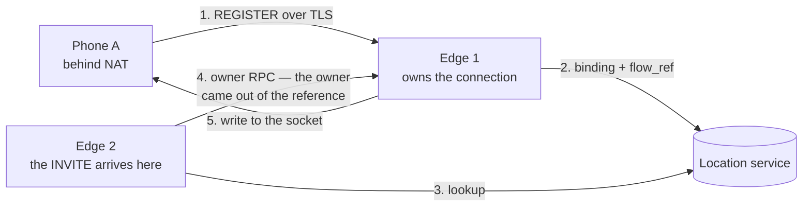

# Affinity and flows

:::caution Preview
Specified and normative, but **not implemented**. Today one node runs, nothing mints a token, and
no connection has an owner. Every rule quoted below has an identifier in a spec that already
exists — "not shipped" is not "not decided". The specs are
[affinity-token](https://github.com/codewandler/sipx-clstr/blob/main/docs/specs/affinity-token.md)
and
[cluster-affinity](https://github.com/codewandler/sipx-clstr/blob/main/docs/designs/cluster-affinity.md).
:::

Two records live in this design, and they answer opposite halves of one question. The **affinity
token** carries what a mid-dialog request needs, in the message, so any edge can forward it with
no lookup. The **flow reference** names the one thing that cannot ride in a message — a client's
open connection — together with the node that owns it.

They share one key set, one cryptographic construction and one parser prologue, which is why they
share a spec. What keeps them from ever being confused for one another is §11.3, and it is worth
its own section below.

## What the token carries

The layout is fixed-offset and version-1 is frozen: affinity-token §3 is the byte table, and it is
the contract. In summary:

| Field | Width | What it is for |
|---|---|---|
| version, key id, nonce | 14 B header | Cleartext by necessity — the parser needs the version and the key before any cryptography, and the AEAD needs the nonce |
| tenant | `u32` | The logical tenant; `0` is reserved. Never a name |
| home shard | `u16` | The rendezvous shard owning the connection-bound side's registration state |
| edge affinity | `u16` | The minting edge — the connection-owner hint for requests toward a connection-bound side |
| direction | `u8` | Which side of the dialog presents this entry, `ORIG` or `TERM` |
| media node | `u16` | The relay holding this dialog's media session; `0` means no media session |
| policy version | `u32` | The tenant's policy version at mint, so an edge can detect stale cached policy without a lookup |
| expiry | `u32` | Absolute UNIX seconds |
| module facts | 0–64 B | Opaque here: contributed by extension modules, returned verbatim, never interpreted by mint or verify |
| tag | 16 B or 12 B | AEAD tag, or truncated HMAC |

Every one of those internal ids is **logical**. Per the design rule a token carries no hostnames
and no raw node identifiers, so `edge affinity = 5` addresses nothing without the cluster's own
configuration to map it.

The whole record is 50–114 bytes in the encrypted layout. That is not incidental: it rides in a
header that appears twice per dialog-forming request and in the `Route` set of every mid-dialog
request afterwards, so affinity-token §5 budgets it against the RFC 3261 §18.1.1 MTU guidance and
verifies the worst case — 157 bytes for the URI parameter, against a 200-byte ceiling — with the
full module-fact region on board.

## Where it rides

The token is a URI parameter, `aft`, on the platform's own Record-Route URIs, base64url-encoded
without padding so it needs no escaping (§5):

```
Record-Route: <sip:edge.cluster.example;lr;aft=AQGgoaKjpKWmp6ipqqsMq3hYTeXCqKEP-hT8-tSR9LWTv4lIVor6ECKn1SaVRa_euZs>
```

From there it goes where SIP already carries routing state, and nowhere else:

- **`Record-Route`**, on dialog-forming requests the platform stays in the path of (§7 M1). Two
  entries are pushed — the pair — one facing each side, because a foreign edge handling a
  mid-dialog request must be able to tell upstream from downstream (§7 M2).
- **`Route`**, because RFC 3261 §12.1.1/§12.1.2 already require endpoints to echo the route set
  back on every in-dialog request. The token comes back to the cluster untouched, and any edge can
  read it.
- **`Path`**, for registrations, using the same parameter and the same budget. That is M3 work,
  scoped by §7 M7 and gated on a typed `Path` header landing in the protocol kernel.

The route set is not recomputed by target-refresh requests (RFC 3261 §12.2.1.2), so a token minted
into a re-`INVITE` could never reach the peer's route set. §7 M6 draws the consequence rather than
inventing a refresh the peer cannot adopt: a dialog outliving the token lifetime fails
**explicitly** on its next in-dialog request, and deployments with dialogs longer than the default
24 hours raise the lifetime. Failing loudly is the design choice; mis-routing quietly is what it
buys out of.

## Signed, and opaque to the client

`Record-Route` contents echo back from untrusted endpoints. An unauthenticated token would
therefore be an open redirect into the cluster, which is why §4 has no unauthenticated mode at all:

- **Encrypted is the default.** `chacha20-poly1305` over the body, with the header as AAD. The
  alternative, `hmac-sha256-96`, leaves the body readable and §4 treats it as an explicit opt-out
  for deployments that accept exposing tenant, shard, edge and media-node ids to endpoints and
  on-path elements.
- **Nothing branches on unauthenticated bytes.** The tag is checked, or the AEAD opened, before
  expiry, direction or any scope field is read — §8 fixes the order, S1 through S9.
- **One verdict for every failure.** Tampered, expired, unknown key and wrong tenant all collapse
  to `Invalid`, and a mid-dialog request carrying one is answered `403`. There is no fallback
  routing and no degraded mode. The reason reaches telemetry and never the wire, because
  distinguishing the failures on the wire would hand an attacker a debugging oracle.
- **Verification is stateless, deliberately.** §9 is normative and forbids a nonce ledger:
  re-presenting the same token on every mid-dialog request *is* the mechanism, not an attack. What
  a captured token grants is bounded by its scope fields and its expiry — that trade is written
  down in §9 rather than left to be discovered.

To a phone the value is 67 opaque characters it copies back verbatim. That is the entire client
contract.

## Domain separation, and what it is for

Both record families are minted under the same keys, and in M3 both may appear as URI parameters
on platform URIs. Accepting one where the other was expected would not be a parse error — it would
be a token body reinterpreted as a flow body, naming an arbitrary node and an arbitrary connection
slot.

So the separation is cryptographic rather than conventional (§11.3):

| Rule | What it fixes |
|---|---|
| DS1 | Version `0x01` is a token, `0x81` is a flow reference. The high bit marks the family, and neither `0x00` nor `0x80` is assigned — so a zeroed buffer is not a valid record of either kind |
| DS2 | Byte 0 is inside the authenticated input of both algorithms. Rewriting it to change a record's family breaks the tag, and nobody without the key can repair it |
| DS3 | Each verifier rejects the other family before key lookup — §8 S1 for tokens, §11.5 FV1 for references |

Vectors FR-18, FR-19 and FR-20 are the three directions of that, including the rewrite attempt.

## `flow_ref`: who owns the connection

Everything a message needs can ride in the message. A client's TCP, TLS or WebSocket connection
cannot: it is a file descriptor in one node's kernel, it cannot be serialised, and it cannot move.

So the location binding does not store the connection. It stores an authenticated **reference** to
it, and the reference names the owner (§11.2): tenant, node, incarnation, connection slot,
generation, transport. 49 bytes, no variable region, no expiry field.

The invariant the whole section exists for:

> A flow reference resolves to the connection it was minted for, or to nothing at all. It never
> resolves to a different connection.

"Or to nothing" is the useful half. A reference whose connection is gone is *detectably* dead, and
detectably dead is what lets the caller try another registered binding instead of writing a
request into a stranger's socket. Three fields make that mechanical: `generation` bumps every time
a slot is reused, so a client's reconnect kills every reference to its old connection (§13.2 RS3);
`incarnation` is the node's boot second, so a restarted node cannot re-issue an identity a live
reference already names (§12.2 CT2, vector FR-9); and `transport` lets a caller refuse a `sips`
target on a plaintext flow without asking anyone (§13.1 D7).

### Why reaching a NAT'd client is an RPC, not a lookup

A NAT'd client is reachable only through the connection it opened, and only from the node holding
that connection. The naive shape is a cluster-wide socket registry that every node queries. This
design does not have one, and does not need one:



Step 4 is the point. `verify_flow` is a pure function of the bytes and the key set the node
already holds, and `claims.flow.node` **is** the owner — §13.1 D2. There is no directory to
consult, no membership query and no cluster-wide lookup. The chain is one location-service read
the request needed anyway, plus two pure functions. When the owner turns out to be this node it is
a local write with no hop at all (D4), which is the common case, since a client's registration and
the calls toward it usually meet at the same edge.

When it is not, the owner RPC (D5) is the **only** cross-node signalling hop the platform
performs. Its outcomes are specified up front, because a taxonomy that collapses them turns a dead
connection into a server error (§13.2):

| Outcome | Meaning | What the request does |
|---|---|---|
| `Delivered` | Written to the connection | The normal path |
| `FlowDead` | The named connection provably does not exist | The target is dropped before any branch exists; the binding is left alone and the next refresh replaces the reference |
| `FlowRejected` | The owner is alive and refusing — bounded queue full, or policy | A branch failure with `503` semantics: the owner is up and saying "not now" |
| `OwnerUnreachable` | The RPC did not reach the owner | The target is dropped as for `FlowDead`, but telemetry keeps them distinct: one is a fact about the connection, the other about this caller's view of the network |

When every target has been removed this way, the request is answered `480 Temporarily Unavailable`
(D8). There is no broadcast and no guessing: a request toward a connection nobody owns is not
deliverable, and saying so is the honest answer. RFC 5626's `430 Flow Failed` is the better answer
for the `FlowDead` case and arrives with the rest of outbound in M3 (D9).

Two consequences worth knowing before you deploy this:

- **UDP registrations carry no reference** (§11.4 FM6). A UDP client has no connection for anyone
  to own, and requests toward it rely on the L4 dataplane's 5-tuple stickiness — which the design
  records as a load-bearing deployment requirement, not an optimisation.
- **A binding must not outlive the flow it names** (§13.3 BI6). A connection-bound registration's
  granted expiry is clamped to the node's idle timeout minus a refresh margin, because otherwise a
  default deployment closes the connection at 3900 s and leaves a binding pointing at it for
  another 23 hours — every call toward that client answered `480` until the binding expires.

## What is true today

One node, in-memory bindings, no shard map, no tokens and no connection table. Nothing on this
page is running code. What exists is the specification: byte-level layouts, the key-rotation
procedure, verification step orders, and test vector tables (`AT-1`…`AT-18`, `FR-1`…`FR-22`) that
the implementation derives its tests from verbatim.

## Where to go next

- [How the cluster works](how-it-works.md) — the one idea this page is an instance of.
- [Registrar shards](registrar-shards.md) — who owns an address-of-record, and the compare-and-swap
  contract that `flow_ref` is stored under.
- [High availability](../operate/high-availability.md) — what a lost node costs, given that a lost
  connection cannot be recovered by anyone.
- The specs:
  [affinity-token](https://github.com/codewandler/sipx-clstr/blob/main/docs/specs/affinity-token.md)
  (§2–§10 token, §11–§14 flow references),
  [location-service](https://github.com/codewandler/sipx-clstr/blob/main/docs/specs/location-service.md)
  (where `flow_ref` is stored), and the
  [cluster-affinity design](https://github.com/codewandler/sipx-clstr/blob/main/docs/designs/cluster-affinity.md)
  (why, and the alternatives that were rejected).
