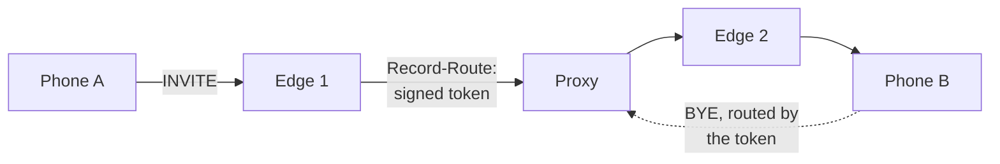

# How the cluster works

:::caution Preview
Specified and normative, but **not implemented**. One node runs today; nothing on this page does.
The links go to the specs that define it.
:::

## The idea

A SIP dialog outlives the request that created it. Something has to know, when a `BYE` shows up
forty minutes later, which media session it belongs to, which registrar shard owns the caller,
and which edge holds the callee's connection.

The obvious place to put that is a database every node reads. The consequence is that the
cluster becomes the source of truth for every call, and the database's availability becomes the
call's availability.

**This platform puts it in the message instead.** When a node forwards a dialog-forming request
it records itself in `Record-Route`, and the URI it records carries a signed token describing
what a future node will need. Phones echo that route set back on every in-dialog request, as
RFC 3261 already requires. A node that has never seen the dialog can route its `BYE` correctly,
because the request itself carries the answer.

The trade is explicit: signature verification on every in-dialog request, in exchange for no
shared call state and no cross-node lookup on the hot path.

## What that buys

- **A node can be lost without losing the routing information**, because the routing information
  was never on that node.
- **A node can be added without warming anything**, because there is no cache to warm.
- **Scale-in is a drain, not a migration** — nothing has to be handed over.

What it does not buy is call survival. If the node holding a client's TCP connection dies, that
connection dies with it. See [High availability](../operate/high-availability.md).

## The pieces

| Piece | What it carries | Spec |
|---|---|---|
| **Affinity token** | Tenant, shard, media node, policy version, expiry — signed, opaque | [affinity-token](https://github.com/codewandler/sipx-clstr/blob/main/docs/specs/affinity-token.md) |
| **Flow reference** | Which edge owns a client's connection, and which generation of it | [cluster-affinity](https://github.com/codewandler/sipx-clstr/blob/main/docs/designs/cluster-affinity.md) |
| **Location service** | AoR to bindings, compare-and-swap, sharded by rendezvous hash | [location-service](https://github.com/codewandler/sipx-clstr/blob/main/docs/specs/location-service.md) |
| **Roles** | Which decision paths a node wires up — never what a request decides. See [Roles](#roles) for how far the released binary carries that | [cluster-config](https://github.com/codewandler/sipx-clstr/blob/main/docs/specs/cluster-config.md) |

## Roles

One binary. What a node does is chosen by configuration, from a closed set: `edge`,
`registrar`, `inbound-proxy`, `outbound-proxy`, `e2e-tester`, `echo`.

**The rule, which is the schema's.** A role selects which decision paths are wired, and never what a
request decides ([cluster-config](https://github.com/codewandler/sipx-clstr/blob/main/docs/specs/cluster-config.md)
§4 R3). The same request reaching the same code takes the same branch regardless of which roles the
node happens to run — that rule is what keeps a multi-role deployment from developing behaviour a
single-role one does not have.

**What the released node does with it, which is a different claim.** The binary derives a capability
set from its declared roles and dispatches through it: a node without `registrar` answers `405` with
an `Allow` header for `REGISTER` rather than storing a binding, and a node given a role this build
has no runtime for — `echo` or `e2e-tester` — refuses to start, by name, before it binds a socket.
`echo` is separately refused in combination with any proxy role, because a node that answers calls
must not also be forwarding them.

That is not the whole matrix yet. The refusal *shape* (`503` with `Retry-After` for a method no role
serves, `481` for an unmatched `CANCEL` under RFC 3261 §9.2), the counted `ACK` drop, and a runtime
for `echo` are open work, tracked as `DP-13`, and none of them is proved by a real-binary role matrix
today. Read the row on [What sipx-clstr is](../intro.md) for the current state rather than inferring
it from the rule above.

## Where to go next

- [Affinity and flows](affinity-and-flows.md) — what the token actually holds.
- [Registrar shards](registrar-shards.md) — who owns an address-of-record.
- [Trunks and carriers](trunks-and-carriers.md) — the egress side.
- [Media](media.md) — why RTP never enters this process.
