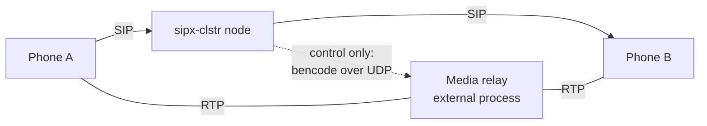

# Media

:::caution Preview
The control path on this page is specified and normative, but **not implemented**: there is no
relay integration in the shipped binary, and no media session it could hold. What is not a preview
is the non-goal — the platform has never touched a media packet and is not going to. The rule IDs
cited below are the normative text, and the links go to the spec that carries them.
:::

## The non-goal, plainly

**No RTP in the SIP process, ever.** This is a vision non-goal, not an implementation detail and
not a performance trade-off waiting to be revisited.

Media therefore reaches an endpoint one of exactly two ways:

1. **It flows directly between the endpoints**, with the platform nowhere near it. This is what
   happens today.
2. **It is relayed by an external process**, which this platform *controls* over a network
   protocol and whose packets it never sees.

Anchoring RTP in the signalling process would couple two workloads with opposite scaling laws —
packets per second against transactions per second — drag kernel-level packet forwarding into a
portable Rust service, and recreate SRTP, ICE, DTLS, transcoding and recording inside a proxy. The
[media-control design](https://github.com/codewandler/sipx-clstr/blob/main/docs/designs/media-control.md)
records the alternatives and why each was rejected.

## Today there is no relay, so media goes direct

Be clear about what the shipped binary does: **there is no media relay, and no control path to
one.** Two phones register with a node, call each other through it, and the audio flows straight
between them. The node forwards SIP and nothing else — no body is parsed, no address in an `SDP`
body is rewritten, no port is allocated anywhere.

That is not a degraded mode waiting for a relay. It is the first of the two ways above, and the
platform must never *require* anchoring: the specified pass-through implementation of the port is
the default, it is indistinguishable at the SIP layer from having no media control at all — no
header, no body change, no timer armed, no datagram — and a call that runs on it mints no media
node into its affinity token (`N1`–`N5`).



The dotted line is the only line this platform is ever on. The solid ones are packets it never
sees — and when no relay is configured, they run straight from `Phone A` to `Phone B` instead.

## The port: five methods, and SDP that stays opaque

The platform's entire view of media is a five-method port — `offer`, `answer`, `update`, `delete`,
`query` — specified in
[media-relay §3](https://github.com/codewandler/sipx-clstr/blob/main/docs/specs/media-relay.md).
SDP in, SDP out, plus session statistics. A handful of its rules explain the shape of everything
else:

- **SDP is opaque bytes in both directions** (`O3`). Between reading a body off the wire and
  handing it to the port, nothing parses, normalises, reorders or re-serialises it, and the bytes
  that come back replace the body verbatim. A round trip through a parser can reorder attributes or
  drop one it does not model, and invalidate a fingerprint or key the relay just computed. This is
  also why neither this repository nor the protocol kernel needs an SDP model.
- **A session is named by the message, not by a handle** — tenant, Call-ID, from-tag, to-tag
  (`O1`). The platform mints no identifier of its own, the initial offer carries no to-tag
  (`O2`), and the from-tag is the tag of the party whose description this is, which is not the
  dialog's initiator when the callee re-offers (`O4`).
- **`update` has no command on the wire** (`U1`). The method exists because a first offer and a
  mid-dialog re-offer have different preconditions and sharply different failure handling; on the
  wire it is an offer carrying both tags.
- **A failed re-offer never tears media down** (`U3`). A rejected re-`INVITE` leaves the session as
  it was (RFC 6141); deleting the anchor would convert a rejected media change into a dropped call.
- **`query` is never called on a signalling path** (`Q2`). A mid-dialog lookup against a media node
  is exactly the shared dependency the affinity token exists to remove.
- **An anchored call cannot leave ICE untouched** (`I1`–`I5`). Endpoints send media to the
  nominated candidate pair rather than to the rewritten addresses in the body (RFC 8445 §12), so
  surviving candidates let ICE-capable endpoints negotiate *around* the relay — and an anchor the
  media does not traverse is worse than no anchor, because the platform believes it is in the path.

Which calls are anchored at all, and which node one lands on, are separate questions with separate
owners; the node is chosen once by rendezvous hashing and rides in the affinity token, so every
re-`INVITE` and `BYE` addresses the same node from any edge with no lookup. What is *not* a
property of the call is which codecs are offered toward a peer and whether that leg is encrypted:
both are declared on the trunk and derived by a pure function of that declaration alone — no
request, no domain, no body and no clock is in scope (`MP1`–`MP4`, and
[Trunks and carriers](trunks-and-carriers.md)).

## The control protocol is a byte contract

Control is the NG protocol: one bencode dictionary per UDP datagram, prefixed by a cookie. The
spec pins it at the byte level rather than describing it, and twelve complete datagrams are fixed
in the vector tables. The health probe is the whole contract in miniature:

```text
request:  0007_2f d7:command4:pinge
reply:    0007_2f d6:result4:ponge
```

- **Framing** (`F1`–`F5`): `cookie SP body`, one message per datagram, no length prefix and no
  terminator — the dictionary's closing `e` ends the message and any byte after it is a decode
  fault. Correlation is by cookie alone, and a well-formed reply matching no in-flight exchange is
  discarded silently rather than counted against a node.
- **The cookie** (`C1`–`C4`): one per *command*, not per transmission, so a retransmitted offer
  returns the first reply instead of allocating a second port set. It is unique across the cluster
  by construction, seeded rather than zero-based so a restarted node cannot re-spend cookies its
  previous life used, and it is never treated as authentication.
- **Canonical encoding** (`E1`–`E5`): dictionary keys are emitted in ascending raw-byte order, so
  the encoding is a *function* of the value and tests can assert byte equality rather than
  semantic equivalence. Strings are raw bytes — no UTF-8 validation, no escaping, no case folding.
  The encoder emits only the keys the spec lists; sending anything else is a spec change, because
  the pinned bytes are the test suite.
- **Decoding is total** (`D6`–`D11`): unknown keys are ignored, a fault is raised rather than a
  panic on anything malformed, and memory is allocated only from bytes already received — a
  forty-byte datagram announcing a nine-hundred-million-byte string costs forty bytes of work.
- **Retransmission is budgeted** (§8): four transmissions on a doubling schedule from 150 ms, an
  exchange budget of 1.5 s and a whole-INVITE media budget of 3 s, which fits inside call setup
  with room to spare.
- **Failure is a taxonomy, not a retry loop** (§9, `X1`): a *rejection* is information about the
  request, so every node in the pool would say the same and retrying elsewhere turns one failed
  call into `N` failed calls; *unreachability* is information about the node and is the only class
  that reselects; *overload* is a third thing, distinguishable only because the platform asks for
  it explicitly.

## rtpengine is the integration target

The first real implementation of the port speaks NG to an **rtpengine** media node, at the
baseline the spec names, and the interop harness runs against that version. rtpengine is named
here as what it is under this project's provenance rule: a system this platform *talks to* and is
*tested against*. It is never cited as precedent — every rule in the spec is justified by an RFC,
by another spec in the repository, or by a property of UDP.

Version drift is handled by contract rather than by version detection (`V1`–`V5`): the adapter
never parses or branches on a version string, unknown keys are ignored, and what a node can do is
discovered from how it answers. Raising the baseline is a story that moves the interop run, the
chart and the pinned bytes together, not a configuration change.

## Where to go next

- [How the cluster works](how-it-works.md) — why no node holds shared call state.
- [Trunks and carriers](trunks-and-carriers.md) — the egress side, including per-trunk media
  policy.
- [media-relay](https://github.com/codewandler/sipx-clstr/blob/main/docs/specs/media-relay.md) —
  the normative port, the NG byte contract, and the vector tables.
- [media-control](https://github.com/codewandler/sipx-clstr/blob/main/docs/designs/media-control.md)
  — the design record, the alternatives, and the open risks.
