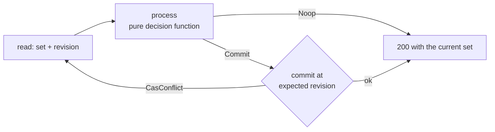

# Registrar shards

:::caution Preview
Sharding is **not implemented**. One node runs today and its bindings live in a process-local
store, so there is no shard map, no owner and nothing to hand off. What is written is the
contract: the
[location-service spec](https://github.com/codewandler/sipx-clstr/blob/main/docs/specs/location-service.md)
is normative, its `LS-*` vectors are executed against the in-memory backend today, and the
compare-and-swap half of it is the part that already ships.
:::

Registrations are the one piece of state this platform cannot put in the message. A binding
outlives every request that touched it, so it lives in a store — and the moment there is more than
one node, the question is who is allowed to write it.

The answer has two layers, and they are independent on purpose. **Rendezvous hashing** decides
which shard owns an address-of-record. **Compare-and-swap** decides what a write means. The first
is placement; the second is correctness, and it holds whether or not the first is right.

## One owning shard per AoR

The shard is a pure function of the key, computed identically by every node from configuration it
already holds. Location-service §8 fixes the input bytes:

```
shard_key = tenant_bytes 0x00 C(aor)
```

`C(aor)` is the canonical byte form of §3 — the RFC 3261 §10.3 step 5 canonical URI, plus the case
and literal normalisations §19.1.4 already declares meaningless, encoded injectively. Rules N1
through N13 are the whole of it, and the vectors `LS-C-1`…`LS-C-22` pin every one.

That canonicalisation is not housekeeping; it is what makes sharding possible at all. RFC 3261
§19.1.4 URI equivalence is a pairwise comparison and is **not transitive**, so it can compare two
contacts but can never key a hash. A shard key needs the opposite: a total function whose output is
compared by equality. Two spellings of one AoR must produce identical bytes, or they land on two
shards and each has half the bindings. `LS-H-2` is that vector — `SIP:%61lice@Atlanta.com` and
`sip:alice@ATLANTA.com` hash the same — and `LS-H-3` is the other half: tenants never share a
shard domain.

Rendezvous hashing is chosen so that adding or removing a shard moves only the keys that belonged
to the changed node, and — the part that matters more here — so that **no coordinator has to
publish a mapping**. Every node computes the owner from the same key and the same configured node
set. Membership is config-first in v1: no consensus system, no discovery protocol, no rebalancing
metadata service. The hash function, the weights and the handoff procedure are still to be
specified; §8 deliberately fixes only the key bytes, so any change to canonicalisation is by
definition a change to that spec.

## The compare-and-swap contract

`REGISTER` processing is read-modify-write: add, replace and remove contacts, compare `Call-ID` and
`CSeq`, apply the expiry rules, return the complete active set. RFC 3261 §10.3 requires that this
happen **in order** and **atomically** per address-of-record — "a particular REGISTER request is
either processed completely or not at all".

So the store's write is not "save this set" but "replace exactly the revision I read":



The decision half is sans-IO — time is an input, the current binding set is data, and nothing in it
reads a clock or a socket. The commit is the only thing that touches the store, and it is fenced by
a revision. Location-service §6 states the rules; what they buy is:

- **No lost update** (K1). Two refreshes racing for one AoR cannot interleave into a set neither
  client asked for. The second commit fails with a conflict, re-reads, and re-processes — vector
  `LS-K-1`.
- **No half-visible set** (K2). One command's binding mutations become visible together or not at
  all, so a lookup never observes three bindings mid-replacement.
- **No state from the past** (K3). Revisions are monotonic per AoR and never reset, including
  across periods where the set is empty. A consumer holding revision *n* discards anything labelled
  lower — and shard handoff fences on the same counter.
- **Bounded staleness rather than trusted invalidation** (K4, K5). The change stream is explicitly
  best-effort; correctness never depends on delivery. A cache that misses every event still
  converges within the configured TTL, default 5 s. The bound is the guarantee.

That contract is backend-agnostic by construction: per-AoR order comes from the revision predicate,
not from any backend's global lock. It is also the part of this page that is not a preview — the
in-memory store implements it today, and the PostgreSQL backend passes the identical suite.

## A re-`REGISTER` that lands somewhere else

This is the failure mode that makes people reach for sticky load balancing. A client refreshes, the
request arrives at a node that does not own the shard — a routing decision changed, a reload is
half-rolled, a client reconnected to a different edge — and now two nodes could be writing one
binding set.

Nothing here corrupts, and the reason is that ownership was never the correctness mechanism:

- **The serialization domain is `(tenant, canonical AoR)`, not a node.** Two writers of one AoR
  serialize through its revision wherever they run. A stale read manifests as a `CasConflict` and a
  retry, never as a lost update (§6 K6) — which is exactly the sense in which the guarantee holds
  "regardless of backend".
- **Retries are bounded and honest.** §5.1 S10 re-reads and re-processes on conflict, three times
  by default, and answers `503` when the store is unreachable or the retries exhaust. It does not
  loop forever and it does not commit a guess.
- **A re-presented command is a no-op, not a second write.** §5.3 B4 makes a `REGISTER` carrying
  the same `(Call-ID, CSeq)` as the applied one an idempotent retry: no mutation, `200` with the
  current set, revision unchanged. That is what lets a UDP retransmission, a CAS re-read and a
  re-presentation at a second node all be safe — `LS-K-2` composes the two rules on purpose.
- **The carve-out is narrow, and §5.3.1 says exactly how narrow.** The comparison is over the
  granted *duration* rather than the absolute deadline, because two deliveries of one `REGISTER`
  never share a `now`. A same-token command asking for something different is a second write and is
  refused `500` (`LS-R-22`), and B4's no-mutation guarantee is about the matched binding, not about
  the whole request (`LS-R-23`).

What a shard map buys, then, is not safety — it is locality: cache hit rates, one writer per AoR in
the common case, and a change stream that has somewhere to be consumed. Safety is the revision.

## Changing the shard count

Adding or removing a shard changes the owner of a fraction of the keys, and there is exactly one
supported way to do it: shard-map reload is a **drain, then a switch** — never a silent rehash.

The reason is the rolling window. A configuration reload does not reach every node at the same
instant, so for some interval nodes hold the old map and the new map concurrently. Under a silent
rehash, an in-flight `REGISTER` write could be split across two owners: one node commits against the
old owner's state, another against the new owner's, and both believe they are the writer. Draining
first means the old owner stops accepting writes and finishes what it has before the new owner
starts, and the handoff fences on the same monotonic revision (§6 K3) that makes every other
consumer safe. That window is named explicitly as a harness scenario, rather than left to be
discovered in production.

The cost is therefore real and worth planning for: a shard-count change is an operation with a
drain window, not a configuration value you edit in place. During it, writes for the moving keys
pause rather than race, reads stay served within the K5 staleness bound, and the change is
observable. That is the trade the design takes over a rehash that is instant and occasionally
wrong.

## What is true today

One node. Bindings in a process-local, in-memory store — restart the node and every registration is
gone. No shard map, no owner, nothing to hand off, and no second node to hand off to. The
PostgreSQL location store is real code with real tests behind a cargo feature, but the binary
cannot be pointed at it. The registrar also has no authentication path from the CLI, so do not put
today's binary on a public address; see [What sipx-clstr is](../intro.md).

What already holds is the shape: canonicalisation, the binding schema, the CAS contract and the
lookup ordering, all vector-tested. Sharding is placement layered on top of a store that was built
to be sharded.

## Where to go next

- [Registrations and calls](../guides/registrations-and-calls.md) — what the registrar does today,
  end to end.
- [Affinity and flows](affinity-and-flows.md) — `flow_ref`, the field a binding carries when the
  client reached the platform over a connection somebody has to own.
- [Addressing](../guides/addressing.md) — AoR canonicalisation from the user's side.
- The specs:
  [location-service](https://github.com/codewandler/sipx-clstr/blob/main/docs/specs/location-service.md)
  (§3 canonicalisation, §5 REGISTER processing, §6 consistency, §7 lookup, §8 the shard key) and
  the
  [registrar-location design](https://github.com/codewandler/sipx-clstr/blob/main/docs/designs/registrar-location.md)
  (why a serializable store, and the alternatives that were rejected).
