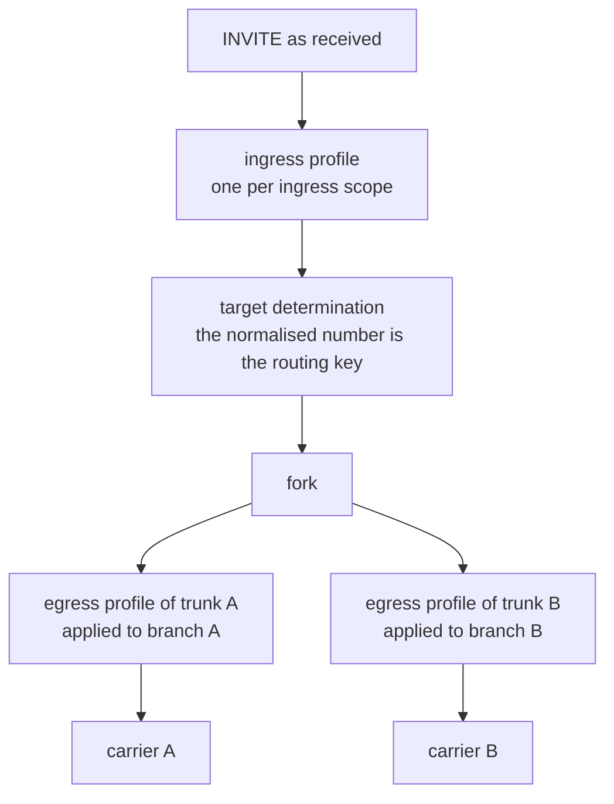

# Trunks and carriers

:::caution Preview
Specified and normative, but **not implemented**. There is no trunk object in the shipped binary,
no normalisation profile and no identity policy — nothing on this page runs. The rule IDs cited
below are the normative text that governs it, and the links go to the specs that carry them.
:::

## A trunk is a peer, not a destination

A destination is an address. A trunk is a **peer interconnect**: the carrier or SBC on the other
side of it has its own requirements, and those requirements are a compliance obligation rather
than a preference. So a trunk is an object that carries its own policy, declared as data, one peer
at a time.

| What a trunk carries | Decided by | Governing text |
|---|---|---|
| **Media policy** — the codecs offered toward this peer, any transcoding, its SRTP mode | a declared `TrunkMediaPolicy`, read by one pure function | [media-relay §13](https://github.com/codewandler/sipx-clstr/blob/main/docs/specs/media-relay.md) — `MP1`–`MP4` |
| **Normalisation profile** — the shape of the numbers that leave toward it | one named profile, bound per trunk | [number-normalisation §8](https://github.com/codewandler/sipx-clstr/blob/main/docs/specs/number-normalisation.md) — `N23` |
| **Identity policy** — whether an identity is asserted toward it, which one, and what a caller's privacy request does | a per-peer trust declaration | [asserted-identity §3, §7, §8](https://github.com/codewandler/sipx-clstr/blob/main/docs/specs/asserted-identity.md) — `A1`, `A14`, `A24` |
| **Quirks** — what this peer needs constrained | a carrier quirk profile, which may *require* and never *assign* | [media-relay §13.6](https://github.com/codewandler/sipx-clstr/blob/main/docs/specs/media-relay.md), [extension-framework](https://github.com/codewandler/sipx-clstr/blob/main/docs/designs/extension-framework.md) |
| **Operational state** — concurrency and calls-per-second limits, a circuit breaker fed by real transaction outcomes, retry budget | the trunk object itself | [routing-trunks](https://github.com/codewandler/sipx-clstr/blob/main/docs/designs/routing-trunks.md) |

The common thread is that every one of them is a value somebody wrote down, not a consequence of
which branch of the routing logic a call fell through. "What do we offer this carrier, and what do
we assert toward it?" is answerable by reading the trunk, and changing the answer for one carrier
touches one trunk.

## Numbers are normalised at exactly two points

Number normalisation is a **profile**: a named, closed vocabulary of four fields, four transforms
and one guard per field, evaluated by a pure function from numbers to numbers. There is no regex,
no capture group and no rule that reads another rule
([number-normalisation §2, §5, §6](https://github.com/codewandler/sipx-clstr/blob/main/docs/specs/number-normalisation.md)).

The part worth knowing before anything else is **where a profile attaches**. Two binding
directions exist and no others (`N23`):

**Ingress — one profile per ingress scope.** It runs on the request as received, after route
information preprocessing (RFC 3261 §16.4) and before target determination (§16.5). Its result is
therefore **the routing key**: what a location lookup looks up, and what route selection selects
on. A deployment that normalises on ingress while registering unnormalised addresses-of-record
looks up a number nobody registered — which is why the binding is per scope and there is no
default, so it is a decision rather than a surprise (`NN-C-6`).

**Egress — one profile per trunk.** It runs **per branch** on the forwarded copy, after the
Request-URI has been set to that branch's target and before the copy goes out. So a fork toward
two carriers sends each branch its own trunk's numbers, and the upstream copy is untouched
(`NN-B-6`).

**Profiles never chain.** At most one profile per direction per request, and the pipeline offers
exactly two application points with no way to compose a third (`N24`). That rule is enforceable
rather than aspirational because `add_prefix` is deliberately *not* idempotent: a profile applied
twice produces a visibly wrong number instead of a silently identical one.

**Some requests are never normalised**, and each exclusion is an RFC requirement rather than a
policy choice (`N25`):

- a request carrying a `To` tag — in-dialog, where the Request-URI is the remote target
  (RFC 3261 §12.2.1.1);
- `CANCEL`, whose Request-URI, `To`, `From` and Call-ID must be identical to the request it
  cancels (RFC 3261 §9.1);
- an `ACK` for a non-2xx response (RFC 3261 §17.1.1.3);
- `REGISTER`, whose address-of-record key belongs to the location service and is no business of a
  trunk profile.

**There is no default and no built-in profile.** With nothing bound, nothing is altered — no
implicit `+`, no implicit zero-stripping, anywhere in the platform (`N27`). A field the bound
profile does not name is left byte-identical, visual separators included (`N9`), and a leading `+`
reaches a carrier **only** because some rule in a bound profile put it there (`N28`). Everything
outside the number position — scheme, host, port, parameters, display name, tags, bodies — is
re-emitted byte for byte (`N3`, `N26`).

## Asserted identity is a per-trunk trust declaration

`P-Asserted-Identity` is not a header the platform decorates a message with. RFC 3325 §1 confines
the whole mechanism to a Trust Domain, and RFC 3324 §2.3 defines membership operationally: `B`
trusts `A` if and only if there is a secure connection between them **and** `B` holds
configuration saying `A` is a member. The second half is a configuration fact whose grain is the
peer.

- **Trust is declared per peer, and the default is untrusted** (`A1`). A trunk with no identity
  policy is a peer outside the trust domain — fail closed.
- **`trusted` carries its basis**, because RFC 3324 §2.3 has two conditions and configuration is
  only the second. A trunk declaring trust without naming what makes the connection secure fails
  the configuration load (`A2`, `G-A3`).
- **Asserting and forwarding are separate axes**, because RFC 3325 splits them. `assert: never` is
  a statement about *synthesis* alone; whether an identity already in hand travels is a second
  decision (`A19`). Collapsing them into one switch is what makes "assert for regulatory trace,
  withhold from an untrusted peer" inexpressible.
- **The emission gate is six cells** over peer trust and what the caller's `Privacy` header said,
  and every `Privacy` header — including one carrying values the spec has never heard of — lands
  in exactly one of them (`A24`, §8.1).

### Privacy is performed or declined, per trunk

Whether a trunk honours a caller's privacy request is a **per-trunk policy**, and it has exactly
two values. It is not a global switch, and there is no partial setting.

`user_privacy: perform` means **all nine** of the entries RFC 5379 §4.1 Table 1 gives the `user`
level across both directions: the anonymous `From` form of RFC 5379 §5.1.4 on requests, plus the
deletion of `Subject`, `Call-Info`, `Organization`, `User-Agent`, `Reply-To` and `In-Reply-To`, and
the response-side treatment of `Server`, `Warning`, `Call-Info`, `Organization` and `Reply-To`.
`user_privacy: decline` does none of them. There is no middle value, because anonymising the `From`
while forwarding headers that name the caller's software, employer and subject line is a claim to
have provided privacy that is false (`A33`, `A35`).

That two-valued shape is what makes the rest checkable:

- **A caller who wrote `critical` asked to be rejected rather than exposed.** The performable set
  is `{ id }`, plus `{ user }` on a trunk that declared `perform`, and nothing else; a request
  asking for a privacy function outside it is rejected with `500` and a reason phrase naming the
  values that were not performed (`A29`, `A30`). A trunk cannot advertise as performable something
  it declined.
- **Without `critical`, the trunk decides** — `on_unperformable`, defaulting to forwarding with
  the un-performed value left in the `Privacy` header for an element downstream that can honour it
  (`A31`).
- **`Privacy: none` can never be out-voted by configuration** (`A22`). It is a `MUST NOT` in both
  RFC 3323 §4.2 and RFC 3325 §7, and a per-trunk policy able to override it would turn a
  compliance control into a suggestion. Its one limit is that it does not rescue a
  `P-Asserted-Identity` that arrived from a peer this platform does not trust: that one is removed
  on arrival, or two words in a header would be a complete identity spoof (`A6`).
- **What happens when the caller said nothing about this header has no platform-wide answer.**
  RFC 3325 §1 requires a Trust Domain's `Spec(T)` to specify it, so it is a required field on the
  trunk with no default, and a policy omitting it fails the configuration load (`A23`, `G-A2`). An
  invalid policy fails a deployment, never a call.
- **Whether the peer is told** is its own declaration: `announce_id` appends `id` to the forwarded
  `Privacy` header on exactly the branches where the identity was withheld, so the peer's own
  downstream keeps withholding (`A27`).

One thing an operator should hear from this page rather than discover: **no configuration here
guarantees that no `P-Asserted-Identity` ever reaches a given peer.** The strongest posture
available is `untrusted` with `when_unspecified: remove`, and `Privacy: none` still emits under it,
because `none` is not a default's to override. The spec records the gap rather than papering over
it (`A19`).

### Where identity and normalisation meet

The two policies meet at a point rather than overlapping, and the order is derived rather than
chosen (`A8`, `A9`): a step runs **before** the trunk's normalisation profile if its output is a
number whose shape is the trunk's business, and **after** if its output is a constant an RFC fixes
byte for byte. So identity synthesis runs first — an asserted number gets the carrier's E.164
treatment like any other — and the anonymous `From` of RFC 5379 §5.1.4 runs after, because
reshaping it would be a departure from the recommended form. The identity policy chooses *whose*
number; the normalisation profile chooses *what shape* it takes.

## Where to go next

- [How the cluster works](how-it-works.md) — the one idea the rest follows from.
- [Media](media.md) — why RTP never enters this process.
- [number-normalisation](https://github.com/codewandler/sipx-clstr/blob/main/docs/specs/number-normalisation.md)
  — the normative profile vocabulary, its binding rules and its vector tables.
- [asserted-identity](https://github.com/codewandler/sipx-clstr/blob/main/docs/specs/asserted-identity.md)
  — the trust declaration, the emission gate and the privacy rules.
- [routing-trunks](https://github.com/codewandler/sipx-clstr/blob/main/docs/designs/routing-trunks.md)
  — the design record: route plans, trunk state, and why each decision landed where it did.
