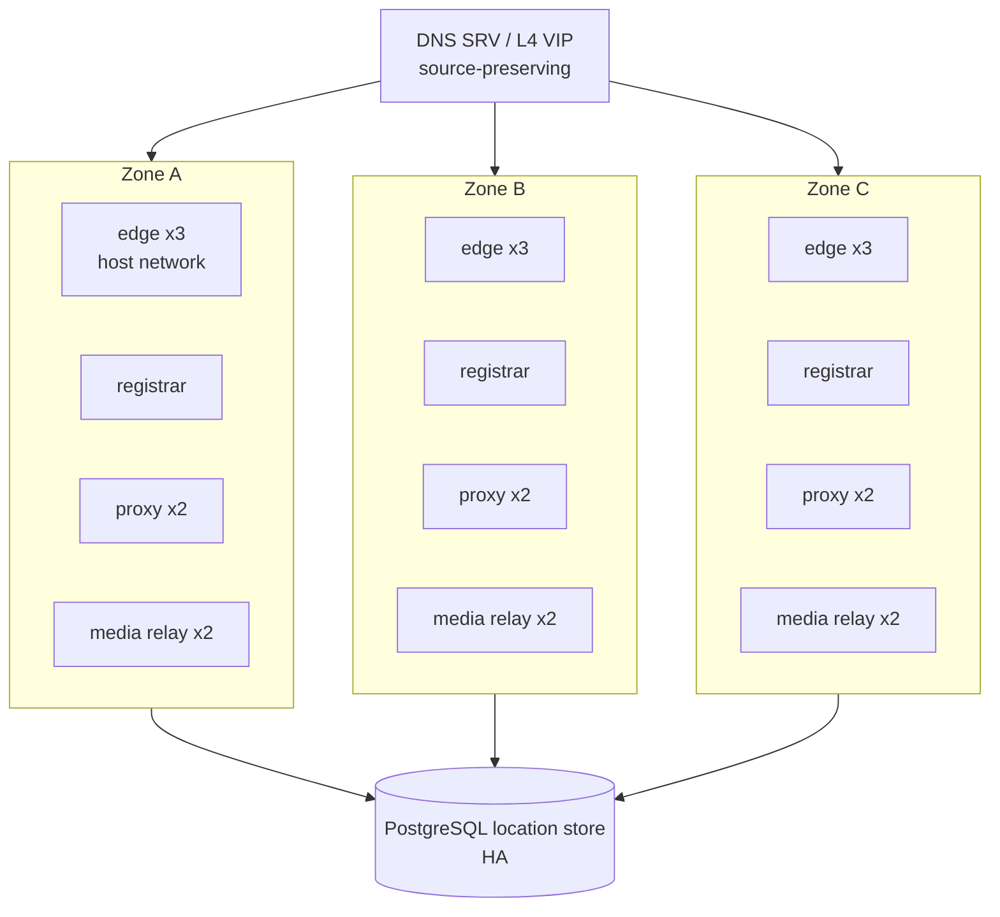

# Deploy

:::caution Preview
**Designed, not shipped.** What runs today is a container and a k3d/devspace profile of **two** nodes
over one location service — two Deployments of one replica each, no operator, and no single address in
front of them. See [Docker and k3d](../guides/docker-and-k3d.md).

The Helm chart in `deploy/helm/` renders a `SipxCluster` custom resource that **nothing serves**:
there is no operator image and no CRD. Everything below describes the arrangement this platform is
meant to be run with, and links the designs that define it.
:::

## What runs today

| | Status |
|---|---|
| A container, one node, `docker run` | **today** |
| Two nodes and one PostgreSQL location service on k3d via devspace — two plain `Deployment`s of one replica each, a `ClusterIP` per node | **today** |
| The Helm chart — it templates and renders | **today, partly** — it renders a resource nothing reconciles |
| The `SipxCluster` CRD and the operator that reconciles it | designed |
| Three zones, roles scaled separately, drain-aware rollout | designed |
| Autoscaling | designed — phase 2, after drain |

The devspace profile proves that two nodes start, share one registrar, and forward a call across the
pair with audio. It does not prove zone spread, media relaying, store availability, or **one address
in front of the two** — each node record-routes its own pod IP, so a single Service would spread
in-dialog requests across nodes that know nothing about each other's dialogs.

## The reference topology

One region, three zones.

A zone here is a **failure domain**, not a shard. Nothing is partitioned by zone: any edge serves
any client, and an address-of-record's owning shard has nothing to do with which zone the request
arrived in. A zone is simply the unit of loss the deployment is designed to survive, which is why
the only hard rule about zones is a floor — see [Scaling](scaling.md).

Per the [deployment design](https://github.com/codewandler/sipx-clstr/blob/main/docs/designs/deployment.md):
3+ edges, 2+ routing/policy instances, 2+ media nodes per media network, the PostgreSQL location
store in HA, DNS SRV for external discovery, and an L4 VIP or per-transport addresses in front.

What is exposed, and where:

| Surface | Exposure |
|---|---|
| UDP and TCP 5060 | public, where required |
| TLS 5061 | public — **designed only**: a `transport: tls` listener is refused at load today, not served |
| WS / WSS | explicit endpoints only |
| RTP | dedicated UDP ranges on the media nodes |
| Management, metrics, RPC | strictly private — never on a public listener |

Media nodes belong on dedicated host-network nodes, or outside the cluster entirely. The
signalling process never carries RTP; it controls a relay over a network protocol
([Media](../clustering/media.md)).

## Roles are configuration, not builds

One binary. What a node does is chosen by configuration from a closed set: `edge`, `registrar`,
`inbound-proxy`, `outbound-proxy`, `e2e-tester`, `echo`.

At small scale every role shares one process. At large scale they scale separately — and nothing
about the code changes between those two deployments, because **a role selects which decision
paths are wired and never what a request decides**. That is the schema's rule (cluster-config §4
R3). Direction, tenant, scope and trunk come from the ingress binding and from the message itself,
so an `inbound-proxy` and an `outbound-proxy` in one process cannot disagree: there is nothing for
them to disagree about.

What the released binary does with the rule today: it derives a capability set from the declared
roles and dispatches through it, so a node without `registrar` answers `405` to a `REGISTER` rather
than storing a binding, and a role this build has no runtime for stops the node at startup by name.
The refusal shape, the counted `ACK` and an `echo` runtime are open (`DP-13`), and the matrix is not
proved by a real-binary test yet — so plan a deployment on the roles the document declares, not on
an assumption about what a wrong one would answer.

One combination is refused outright: the probe roles beside the call-path roles. A probe that enters
through the node it is probing measures a path no caller takes, so the `e2e-tester` sits outside
the border it tests.

The role set, the configuration document and its projection onto a single node are defined in
[cluster-config](https://github.com/codewandler/sipx-clstr/blob/main/docs/specs/cluster-config.md).

## Host networking, and what it does to replica counts

`edge` and `registrar` run on the **host network**. This is not a performance choice.

UDP 5060 must see the real source address. A NAT or conntrack layer in front of signalling
rewrites exactly the thing SIP's own addressing depends on: `Via`/`rport` semantics, the flow a
response has to come back on, and the edge that must keep receiving a transaction's
retransmissions, its `CANCEL`, and the `ACK` to a non-2xx final response. Those messages landing
on the edge that holds the transaction is a **correctness requirement, not tuning** — an HTTP-shaped
ingress understands none of it, and the requirement on the dataplane is L4 with source
preservation and same-flow affinity.

That decision has a scheduling consequence that surprises people:

> Every replica of a host-networked role binds the same node-global port. Two replicas of that role
> therefore cannot share a node, and a role's replica count is bounded by the number of schedulable
> nodes.

So a replica count above the node count is a **placement error, not a capacity decision**. The
extra pods do not schedule, and no amount of headroom on the existing nodes changes that — adding
capacity means adding nodes. The operator's job is to say so as a status condition rather than
leave pods Pending for someone to discover, and to validate the port arithmetic at
admission so two roles on one node cannot claim the same port or overlapping media ranges.

It is also the honest limit of the local profile: a single-node k3d cluster is *clustered but
co-located*, and can demonstrate the configuration and the reconcile loop but never zone spread.

## The operator and the chart

The chart is the delivery vehicle; the operator is what makes the deployment survive its own
lifecycle.

`helm install` is meant to deploy the operator, its CRDs and RBAC, and a single `SipxCluster`
resource rendered from `values.yaml`. That mapping is 1:1 by design — the custom resource **is**
the configuration schema, versioned with it, so "the config file" and "the desired state" are one
document rather than two dialects that drift.

From that one resource the operator derives the rest: workloads per role, Services, ConfigMaps for
node configuration, Secrets for credentials and token keys, PodDisruptionBudgets, NetworkPolicies
that keep management interfaces private, and the scrape configuration for the metric set
([Observability](observability.md)).

An operator rather than templates alone, because the events that break a SIP cluster are precisely
the ones a template cannot express:

| Event | What has to happen | Why a template cannot |
|---|---|---|
| Rolling an edge | Stop accepting, let clients re-register elsewhere, wait a bounded drain window, then terminate | Long-lived TCP/TLS/WS flows cannot be moved; they have to be given up |
| Changing registrar replicas | Drain-then-switch on the shard map — the losing node finishes what it holds and publishes `drained`; the gaining node starts on that, or on a bounded and counted deadline | A silent rehash splits ownership of an address-of-record |
| Rotating token keys | Distribute to every node first, activate second | A key minted before it is distributed is a token some healthy node cannot verify |
| An incompatible role or profile combination | Fail at reconcile, naming the field | A template finds out on a call |

Changing configuration is editing that document and re-deploying. The operator classifies every
changed field: hot-reloadable subsets (trunks, token keys, shard map, route policy) are pushed to
running nodes with no restart and no call disturbed; anything else becomes a staged rollout, one
role and one zone at a time, gated between stages on the probe verdict and the invariant metrics;
and an invalid change is rejected outright with the last good configuration still running.

## Nothing serves the custom resource yet

Stated plainly, because the chart's presence in the repository reads like a deployment story and
is not one:

- There is **no operator image**. The reconcile loop is specified but not built.
- There is **no CRD**. Until the custom resource is pinned, its group and version are provisional,
  and applying the rendered object to a cluster fails because the API server has no type for it.
- The chart's defaults are a *default deployment set* aimed at a single-node local cluster — one
  node per role, one PostgreSQL, one managed rtpengine, an echo trunk, the probe on. That is a
  local development target, not a production topology.

One more caution: **do not read `deploy/helm/values.yaml` as the configuration schema.** It is a
real proposal and much of it was adopted, but where it disagreed with a normative spec the spec
won, and bringing the chart to the schema is open work. For what the configuration
surface actually is today, see [Configuration](../reference/configuration.md).

## Where this is defined

- [deployment](https://github.com/codewandler/sipx-clstr/blob/main/docs/designs/deployment.md) —
  roles, the three-zone reference topology, the dataplane constraints, and the HA statement.
- [k8s-deployment-operator](https://github.com/codewandler/sipx-clstr/blob/main/docs/designs/k8s-deployment-operator.md) —
  the chart, the custom resource, the reconcile loop, and the lifecycle machinery.
- [cluster-config](https://github.com/codewandler/sipx-clstr/blob/main/docs/specs/cluster-config.md) —
  the configuration document, its projection onto a node, and the reload classes.

Next: [Scaling](scaling.md) — what the cluster resizes on, and why it is never CPU.
