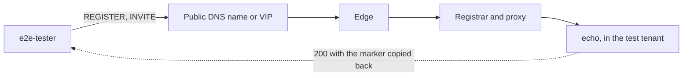

# Observability

:::caution Preview
One thing on this page exists today: a log stream on stderr, controlled by `RUST_LOG`. Everything
below "What exists today" is **specified, not shipped** or **designed**, and each section says
which. The links go to the specs and design records that define it.
:::

## What exists today

A log stream. That is the entire observability surface of the shipped binary.

Logs go to **stderr**, never stdout, so the two startup lines stay parseable. The level comes from
`RUST_LOG` and defaults to `info`. Colour is switched off deliberately — this log is read by
scripts as often as by people, and escape codes between a field name and its value defeat an
honest `grep`. [Run a node](../guides/run-a-node.md) has the details.

There is nothing else. Specifically, and because each of these is the thing people assume is
there:

| | Status |
|---|---|
| `RUST_LOG` levelled log on stderr, ANSI disabled | **today** |
| A metrics endpoint — Prometheus or otherwise | specified, not shipped |
| A management port to serve it on | specified, not shipped |
| Call detail records | specified, not shipped |
| Signalling capture to a trace store | specified, not shipped |
| The synthetic end-to-end probe | specified, not shipped |
| Traces that correlate a call across nodes | designed |

You cannot scrape this node, you cannot bill from it, and you cannot alert on anything except the
process being alive and whatever your log pipeline makes of its stderr. If that is not enough for
where you were going to run it, it is not enough — see [Does this fit?](../guides/does-this-fit.md).

## The designed surface

Four things, one configuration section. The schema puts `metrics`, `logFormat`, `hep` and `cdr`
under `observability`, cluster-scoped and reloadable, and the probe under its own `probe` section
— see
[cluster-config](https://github.com/codewandler/sipx-clstr/blob/main/docs/specs/cluster-config.md)
§7.

### Metrics that prove the invariants

The design's rule is that metrics prove the architecture rather than decorate it: **an invariant
metric that moves is a bug**, and alerting is built on exactly those.

| Metric | What a non-zero, or a change, means |
|---|---|
| Cross-node dialog lookups | The count must read **zero**. Anything else means a node went looking for dialog state instead of reading it out of the message — the failure the whole design exists to prevent. It is the M2 exit criterion. |
| Token verification failures, by cause | A key distribution problem, a clock problem, or a forged token. The cause is what tells them apart. |
| Flow-RPC delivery outcomes | Whether requests are reaching the edge that owns a client's connection, and how often that edge is gone. |
| Per-trunk breaker state | Which carrier is currently shedding, and since when. |
| Per-shard registration write latency | The compare-and-swap path to the location store, per shard, so a slow shard is attributable rather than an average. |

That is deliberately not a general-purpose dashboard set. Rate, latency and error counters exist
alongside it; these are the ones whose *value* is an assertion.

### Logs

Structured SIP event logs, with a `logFormat` that selects human or JSON output, and traces that
correlate a call across nodes. Today's stderr stream is the degenerate case of this: one
process-local stream, one format, and no cross-node correlation identifier even when two nodes
share a registrar.

### Call detail records

The CDR field set is **configuration**, not code, because the field list is a contract with
whatever consumes it — usually billing, which does not accept a schema change as a release note.
Adding or removing a field is a config change; fields can carry values decided during routing
(direction, selected egress, tenant, media statistics); the emission target is pluggable.

One rule matters more than the field list: **probe traffic is excluded from CDR and from business
metrics**, and counted in probe metrics instead. A synthetic call in a revenue report is a
data-integrity defect
([e2e-probe](https://github.com/codewandler/sipx-clstr/blob/main/docs/specs/e2e-probe.md) B3).

### Signalling capture

Duplication of SIP signalling to a capture collector over HEP, enabled **per transport**. The
per-transport switch is the point: a deployment that already captures plaintext off the wire with
a node-level agent wants to duplicate only the encrypted transports from the proxy, because those
are the ones no tap can read — and duplicating both produces two entries for one message in the
trace store. Capture failure never affects call handling.

## The synthetic probe

Every other form of telemetry here observes the platform from the inside. None of it can observe
what never reached a process: a listener that stopped binding after a restart, a VIP that stopped
preserving source addresses, an expired certificate, a DNS record pointing at a drained zone, a
firewall change upstream of everything that could have reported it. In all of those the nodes look
healthy and the service is down.

**The probe is a role that dials the platform's front door like a customer.** `e2e-tester` and
`echo` are two entries in the role set, selected by configuration on the same binary, and neither
is a signalling role.

### What a run does

Four steps, in order, each with its own timeout. The first failure ends the run and the remaining
steps are not attempted.

| # | Step | Succeeds when | Default timeout |
|---|---|---|---|
| P1 | `Resolve` | The target resolves per RFC 3263, or is a literal address | 2 s |
| P2 | `Register` | A `2xx` to REGISTER, having answered any challenge | 5 s |
| P3 | `Invite` | A `2xx` to INVITE **and** the correlation marker reflected | 10 s |
| P4 | `Bye` | A `2xx` to BYE | 5 s |

Two properties are worth calling out because they are what make the result trustworthy:

- **Every attempted step is recorded**, with its elapsed time, including the ones that succeeded
  before the one that failed. A verdict without the steps behind it says something is wrong and
  nothing about where, which is the difference between an alert and a page someone can act on.
- **The probe does not retry.** One attempt per step; the transport layer retransmits per
  RFC 3261 and that is the only retry there is. A probe that retried would mask exactly the
  marginal loss it exists to report.

The correlation marker is a run-unique opaque token carried outbound in
`Subject: sipx-probe/<marker>` and required back in the `2xx`. Without it, "the call was answered"
cannot distinguish this probe's call from a stale dialog, a duplicate, or another probe's traffic —
and it is what catches the named failure the design was written for: the edge answers `200` but the
echo never rang.

### The verdicts

Three values, and the third is the load-bearing one.

| Verdict | Means |
|---|---|
| `Pass` | Every step succeeded and the marker came back. |
| `Fail{step, cause}` | A step the **platform** is responsible for did not succeed. Always carries which step and why. |
| `Inconclusive{fault}` | The probe could not conduct a valid test at all. |

The causes and faults are closed lists. Causes are platform faults — `Timeout`,
`Rejected{status}`, `MarkerMismatch`, `Unreachable`, `ResolutionFailed`, `Shed{retry_after}`.
Faults are the probe's own — `BadCredentials`, `Misconfigured`, `NoLocalResource`, `ClockSkew`,
`Cancelled`, `Internal`.

Several distinctions in those lists exist because collapsing them would produce a wrong incident:

- `Rejected{status}` carries the status, because `403` and `503` are different outages.
- `Shed{retry_after}` is not a broken listener. Shedding is the platform working as designed under
  load, and silence and shedding must not look alike.
- `MarkerMismatch` is not a network failure. The call was answered by something that is not our
  echo, which is a routing fault and reads differently.

### Why it is drawn outside the border

The probe enters through the public path — the DNS name customers resolve, the L4 VIP, or one
specific edge address — and an internal address is **not allowed to be a target**: not a pod IP,
not a service name, nothing that bypasses the path a caller takes. A probe that skips the front
door cannot detect a broken front door, and the front door is what breaks.

That constraint reaches into the deployment. A process running `echo` runs **no proxy role**, and a
configuration asking for both is refused at load, where a human is still watching, rather than at
runtime, where nobody is. The reason is the same one: a probe that entered through the node it is
probing would measure a path no caller takes. It is also why the architecture drawing puts these
two roles outside the cluster border rather than inside it.

Nothing hooks the probe path either. No extension phase fires differently for probe traffic,
because a probe that took a different path through the platform would stop measuring the path
customers take. The exclusion from CDR and business metrics is applied at the *reporting* boundary,
not by routing probe traffic differently.

### Why `Inconclusive` is not a failure

A probe with rejected credentials, an unusable configuration, no local socket, or a clock that
stepped is not evidence that the service is down. It is evidence that the *measurement* is void.

So `Inconclusive{fault}` is **never reported as a platform failure**, never counted in the success
ratio, and alerted on separately. Conflating "the service is down" with "the prober is broken"
trains operators to ignore the alert, and an ignored alert is worse than no alert at all.

The same reasoning fixes the residual case: a condition that fits no named cause is
`Inconclusive{fault: Internal}`, not a `Fail`, because a probe that invents a platform failure it
cannot substantiate is worse than one that admits confusion.

One boundary is drawn on purpose and reads backwards until you see it. A `401` or `407` *after* the
probe has already answered a challenge is a `Fail`, not `BadCredentials` — repeated challenges are
a platform behaviour. A challenge the probe cannot answer at all is `BadCredentials`. The test is
whether the probe had a credential to offer.

### It cannot become the outage

A probe that can hurt the deployment it watches is worse than no probe, so the blast-radius rules
are normative rather than advisory:

- Probe traffic lives in a dedicated **test tenant with no external trunks**, so a probe can never
  place a call towards a carrier — the failure mode that would otherwise cost real money and reach
  a real telephone. That tenant is not privileged: no cross-tenant lookup, no trunk access,
  rate-capped.
- Probe rate is bounded per target and in total, and counted against ordinary CPS caps.
- A probe is shed before ordinary traffic when the two compete.
- Every run cleans up: the dialog is ended even when the verdict is already decided, and the
  registration is removed whatever the outcome. A cleanup failure is recorded and counted
  separately, and never changes a verdict — a leaked binding is a probe defect and a failed call is
  a platform one.
- The echo answers **only** calls carrying a marker, and only within its tenant. It holds no state
  between calls, and it never touches RTP.

### Triggering a run

The control API is a trigger, not a second code path: an on-demand run and a scheduled run produce
the **identical** run record. `GET /probes` lists the configured probes and their targets,
`POST /probes/{name}/runs` triggers a run, `GET /probes/{name}/runs/{id}` returns the record.

That is what makes it usable as a deployment gate — a release pipeline or the operator can call it
after a rollout and refuse to proceed on a failed verdict, knowing it is looking at the same
measurement the schedule produces. The API binds **only** to the private management interface,
never to a listener carrying SIP or facing a public network, and every request is authenticated.

## Where the rules live

| Document | What it fixes |
|---|---|
| [e2e-probe](https://github.com/codewandler/sipx-clstr/blob/main/docs/specs/e2e-probe.md) | Normative: the run plan, the marker, the target matrix, the verdict taxonomy, the blast-radius rules, the echo, and the test vectors behind all of it |
| [e2e-tester](https://github.com/codewandler/sipx-clstr/blob/main/docs/designs/e2e-tester.md) | Why an outside view exists at all, and the alternatives rejected |
| [deployment](https://github.com/codewandler/sipx-clstr/blob/main/docs/designs/deployment.md) | The invariant metric set, the CDR and capture stories, and the operational contract they belong to |
| [cluster-config](https://github.com/codewandler/sipx-clstr/blob/main/docs/specs/cluster-config.md) | Where `observability`, `probe` and `echo` live in the configuration document, and their reload class |

## Where to go next

- [High availability](high-availability.md) — what a lost node actually costs, which is the
  question the invariant metrics and the probe exist to answer.
- [How the cluster works](../clustering/how-it-works.md) — why there is no cross-node dialog
  lookup to count in the first place.
- [Configuration](../reference/configuration.md) — what the binary reads today versus what the
  schema designs.
